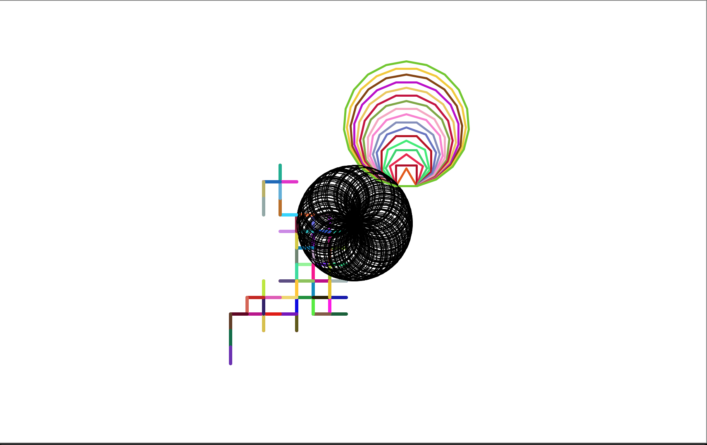
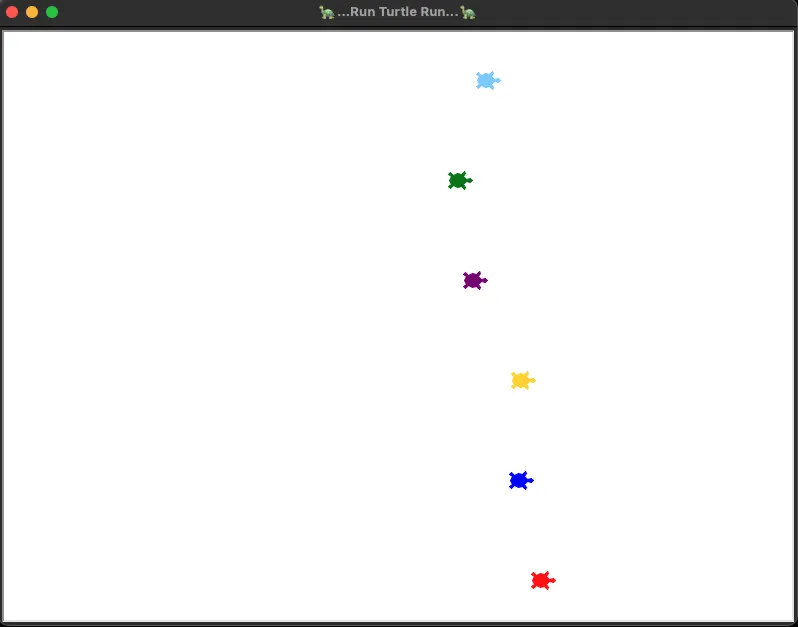
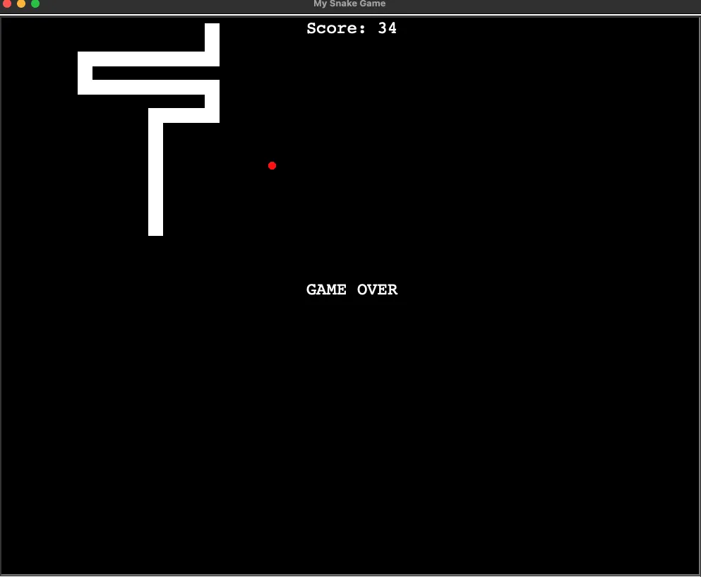

# Python 🐍
The python repo represents the knowledge and understanding of the programming language. 
It holds in it folders of different projects throughout my learning journey.
The code for the different projects is open to anyone who wants to modify it or add new logic to it.
Just let me know and I will add you to the repository.

___

##### List of Projects and their difficulty level
|      Project      | Difficulty Level | Completed |
|:-----------------:|:----------------:|:---------:|
|   Hangman🧍🏽‍    |     Beginner     |     ✅     |
|  Minimal Art 🎨   |   Intermediate   |     ✅     |
|    Quizzler ❓     |   Intermediate   |     ✅     |
| Run Turtle Run 🐢 |   Intermediate   |     ✅     |
|   Snake Game 🐍   |   Intermediate   |     ✅     |
|                   |                  |           |

___

## Hangman 🧍🏽‍♂️
The hangman project was a beginner level game to test basics.
I had fun because it required me to start thinking like a programmer.
I used ascii art to make it a bit nice (The Ascii is used for the title).
**Ascii link:** [_Text to Ascii art Generator_](http://www.patorjk.com/software/taag/#p=display&f=ANSI%20Shadow&t=>As).
This solidifies my understanding of:  
* If, elif, and else statement.
* for loop and while loop
* and Boolean
___
## Minimal Art 🎨
This was another fun project for me because I got to use the turtle module
to create beautiful art. Documentation reading was the main goal with this project.
As a programmer, you must be able to read documentation because in most cases 
you will be working with APIs and Packages.   
Anyway, the project code is free to customize to your liking and create beautiful 
minimalistic art like this:  
  
You can even modify the code to take an ImageGrab anytime you run the code.
___
## Quizzler ❓
The Quizzler game is an introduction to **OOP - Object-Oriented Programming**.
It focuses on the concept of OOP and the benefits of OOP. How to create a class,
how to create Attributes and Methods, and how attributes and methods are a fancy 
way of saying Variables and Functions. Also, how to initialize and create Objects with 
the Class blueprint.
___
## Run Turtle Run 🐢
The Run Turtle Run game is a simple game created to deepen my understanding of the Turtle
module.
It takes a bet on which turtle would by the color, and the turtles move from the left 
side of the screen to the right.

___
## Snake Game 🐍
The classic snake game solidifies everything learned about OOP and the Turtle module. It was a tough one
 that tests your understanding of how to structure your code, and test your logic.

