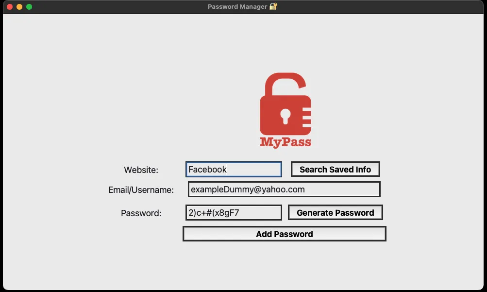

# Python 

The python repo represents the knowledge and understanding of the programming language. 
It holds in it folders of different projects throughout my learning journey.
The code for the different projects is open to anyone who wants to modify it or add new logic to it.
Just let me know and I will add you to the repository.

> [!Note]   
> The projects and the learning journey comes from Angela Yu's best-selling **```100 
Days of Code: The Complete Python Pro BootCamp```** on Udemy.
I 💯 recommend to anyone who is serious about mastering Python.
Every day you build a project, for 100 Days, learning the ins and out of the language.
These are just a handful of projects.
She pushes you gently by taking off the training wheels and lets you test your understanding and 
knowledge of the language, thinking like a programmer all the way.
I will not be pushing all the projects on GitHub, only a handful.   
> Some project named in the list below may not be discussed below like the others,
> nor would a screenshot of the project be uploaded.
> However, you check out the project folder above 👆🏽

___

##### List of Projects and their difficulty level
|       Project       | Difficulty Level | Completed |
|:-------------------:|:----------------:|:---------:|
|    Hangman🧍🏽‍     |     Beginner     |     ✅     |
|   Minimal Art 🎨    |   Intermediate   |     ✅     |
|     Quizzler ❓      |   Intermediate   |     ✅     |
|  Run Turtle Run 🐢  |   Intermediate   |     ✅     |
|    Snake Game 🐍    |   Intermediate   |     ✅     |
|     Pomodoro ⏱️     |   Intermediate   |     ✅     | 
 | Password Manager 🔐 |   Intermediate   |     ✅     |

___

## Hangman 🧍🏽‍♂️ ( terminal )
The hangman project was a beginner level game to test basics.
I had fun because it required me to start thinking like a programmer.
I used ascii art to make it a bit nice (The Ascii is used for the title).
**Ascii link:** [_Text to Ascii art Generator_](http://www.patorjk.com/software/taag/#p=display&f=ANSI%20Shadow&t=>As).
This solidifies my understanding of:  
* If, elif, and else statement.
* for loop and while loop
* and Boolean
___
## Minimal Art 🎨 ( turtle )
This was another fun project for me because I got to use the turtle module
to create beautiful art. Documentation reading was the main goal with this project.
As a programmer, you must be able to read documentation because in most cases 
you will be working with APIs and Packages.   
Anyway, the project code is free to customize to your liking and create beautiful 
minimalistic art like this:  
  
You can even modify the code to take an ImageGrab anytime you run the code.
___
## Quizzler ❓ ( terminal )
The Quizzler game is an introduction to **OOP - Object-Oriented Programming**.
It focuses on the concept of OOP and the benefits of OOP. How to create a class,
how to create Attributes and Methods, and how attributes and methods are a fancy 
way of saying Variables and Functions. Also, how to initialize and create Objects with 
the Class blueprint.
___
## Run Turtle Run 🐢 ( turtle )
The Run Turtle Run game is a simple game created to deepen my understanding of the Turtle
module.
It takes a bet on which turtle would by the color, and the turtles move from the left 
side of the screen to the right.

___
## Snake Game 🐍 ( turtle )
The classic snake game solidifies everything learned about OOP and the Turtle module. It was a tough one
 that tests your understanding of how to structure your code, and test your logic.

___

## Password Manager 🔐 ( tkinter )
The Password manager app is a very useful project and one I was happy to build.
I am bad at recollecting password and user login for application that I don't use 
frequently, so the application would save me a lot of "***I have forgotten password***"
scenarios 😀.
I only need to run the program anytime I want to save a password.


___

## Spotify Playlist ( webscraping - Beautiful Soup)
>[!NOTE]  
> The idea of scraping a website, looking for data and all sort of goodies is cool, but, there are
> set rules we must follow in other not to abuse it. There are laws to what is legal and not legal 
> in webscraping.  
> * You can't commercialize copyrighted content on your website.
> * You can't scrap data that's behind authentication (like Facebook, Instagram, etc.).
> * If there's a public API use it instead (ethics).
> * Respect the website owner. Put a "/robots.txt" after the url to know what you are not allowed to do. (ethics)

Spotify playlist explores the webscraping using Beautiful Soup. It involves a lot
of documentation on how to achieve your desired goal. Beautiful Soup documentation is 
well documented and easy to get going. The project involves scraping the Billboard Hot 100
for a specific year, getting the song data, and creating Spotify playlist using the Spotipy API.  


___

## Bloogy.DEV 
To be continued......
